# 海洋生物多样性信息管理系统 — 软件设计文档

> 广东海洋大学 · 软件综合实践课程  
> 技术栈：Vue3 + Vite + Element Plus + Pinia + Leaflet + ECharts + Vitest

---

## 目录

1. [需求文档](#一需求文档)
2. [系统用例图](#二系统用例图)
3. [系统架构图](#三系统架构图)
4. [类图](#四类图)
5. [ER 实体关系图](#五er-实体关系图)
6. [流程图](#六流程图)
7. [时序图](#七时序图)
8. [状态图](#八状态图)

---

## 一、需求文档

### 1.1 项目背景

海洋生物多样性是地球生态系统的重要组成部分。本系统旨在为广东海洋大学科研人员、学生及公众提供一个统一的海洋生物信息管理与共享平台，实现对海洋生物物种数据、生态系统信息及实地观测记录的数字化管理。

### 1.2 用户角色

| 角色 | 说明 | 权限 |
|------|------|------|
| 管理员 | 系统管理人员 | 全部操作权限（增删改查 + 用户管理） |
| 科研人员 | 高校研究人员 | 增删改查物种、观测记录、生态系统 |
| 学生 | 在校学生 | 查询、添加观测记录 |
| 访客/公众 | 普通用户 | 只读查询 |

### 1.3 功能需求清单

#### 模块一：用户权限管理
- FR-01：用户注册（邮箱/用户名+密码）
- FR-02：用户登录 / 退出（JWT Token 认证）
- FR-03：基于 RBAC 的角色权限控制
- FR-04：个人资料查看与修改
- FR-05：管理员对用户进行增删改查与角色分配
- FR-06：操作日志记录

#### 模块二：物种信息管理（核心）
- FR-07：新增物种（中文名、学名、门/纲/目/科/属/种、形态描述、生态习性、地理分布、保护等级、濒危状态、图片、参考文献）
- FR-08：编辑/删除物种信息（管理员/科研人员）
- FR-09：多条件检索（名称模糊搜索、门纲筛选、保护等级筛选、濒危状态筛选）
- FR-10：物种详情展示（含图片、完整分类学信息）
- FR-11：卡片视图与表格视图切换

#### 模块三：生态系统与观测记录管理（核心）
- FR-12：生态系统管理（珊瑚礁、红树林、海草床、深海等分类管理）
- FR-13：新增观测记录（时间、地点、经纬度、天气、水温、盐度、能见度、深度、观测描述）
- FR-14：观测记录关联物种（多对多关系）
- FR-15：观测记录编辑/删除
- FR-16：按时间、地点、物种筛选观测记录

#### 模块四：可视化与统计分析
- FR-17：物种地理分布地图（Leaflet 标记点）
- FR-18：观测地点地图展示
- FR-19：物种门类分布饼图（ECharts）
- FR-20：保护等级统计柱状图
- FR-21：月度观测趋势折线图
- FR-22：综合数据看板（总物种数、总观测次数、生态系统数量等）
- FR-23：数据导出（CSV 格式）

### 1.4 非功能需求

| 类型 | 要求 |
|------|------|
| 性能 | 页面加载时间 < 2秒，列表查询响应 < 500ms |
| 安全 | JWT 认证、RBAC 权限控制、前端路由守卫 |
| 可用性 | 系统可用率 ≥ 99%，响应式布局 |
| 可维护性 | 组件化开发，代码注释覆盖率 ≥ 60% |
| 测试 | 单元测试覆盖率 ≥ 80%，核心用例 100% |

---

## 二、系统用例图

> 复制以下代码到 [Mermaid 在线编辑器](https://mermaid.live) 即可生成图片

### 2.1 整体用例图

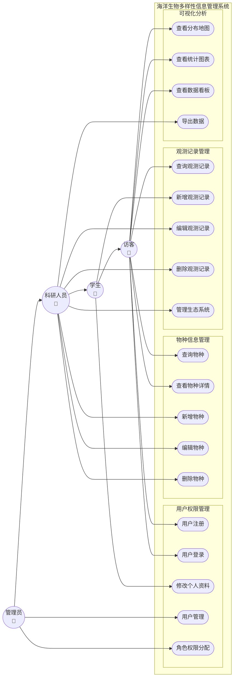
```mermaid
graph LR
    访客(("访客\n👤"))
    学生(("学生\n👤"))
    科研人员(("科研人员\n👤"))
    管理员(("管理员\n👤"))

    subgraph 海洋生物多样性信息管理系统
        subgraph 用户权限管理
            UC1([用户注册])
            UC2([用户登录])
            UC3([修改个人资料])
            UC4([用户管理])
            UC5([角色权限分配])
        end
        subgraph 物种信息管理
            UC6([查询物种])
            UC7([查看物种详情])
            UC8([新增物种])
            UC9([编辑物种])
            UC10([删除物种])
        end
        subgraph 观测记录管理
            UC11([查询观测记录])
            UC12([新增观测记录])
            UC13([编辑观测记录])
            UC14([删除观测记录])
            UC15([管理生态系统])
        end
        subgraph 可视化分析
            UC16([查看分布地图])
            UC17([查看统计图表])
            UC18([查看数据看板])
            UC19([导出数据])
        end
    end

    访客 --> UC1
    访客 --> UC2
    访客 --> UC6
    访客 --> UC7
    访客 --> UC11
    访客 --> UC16
    访客 --> UC17
    访客 --> UC18

    学生 --> 访客
    学生 --> UC3
    学生 --> UC12

    科研人员 --> 学生
    科研人员 --> UC8
    科研人员 --> UC9
    科研人员 --> UC10
    科研人员 --> UC13
    科研人员 --> UC14
    科研人员 --> UC15
    科研人员 --> UC19

    管理员 --> 科研人员
    管理员 --> UC4
    管理员 --> UC5
```

### 2.2 物种管理详细用例图

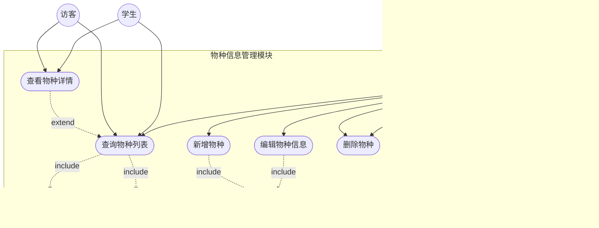
```mermaid
graph TD
    访客(("访客"))
    学生(("学生"))
    科研人员(("科研人员"))
    管理员(("管理员"))

    subgraph 物种信息管理模块
        UC_S1([查询物种列表])
        UC_S2([查看物种详情])
        UC_S3([新增物种])
        UC_S4([编辑物种信息])
        UC_S5([删除物种])
        UC_S6([切换视图模式])
        UC_S7([多条件筛选])
        UC_S8([导出物种数据])
        UC_VAL([表单验证])

        UC_S1 -. include .-> UC_S7
        UC_S1 -. include .-> UC_S6
        UC_S2 -. extend .-> UC_S1
        UC_S3 -. include .-> UC_VAL
        UC_S4 -. include .-> UC_VAL
    end

    访客 --> UC_S1
    访客 --> UC_S2
    学生 --> UC_S1
    学生 --> UC_S2
    科研人员 --> UC_S1
    科研人员 --> UC_S3
    科研人员 --> UC_S4
    科研人员 --> UC_S5
    科研人员 --> UC_S8
    管理员 --> UC_S5
```

### 2.3 观测记录用例图

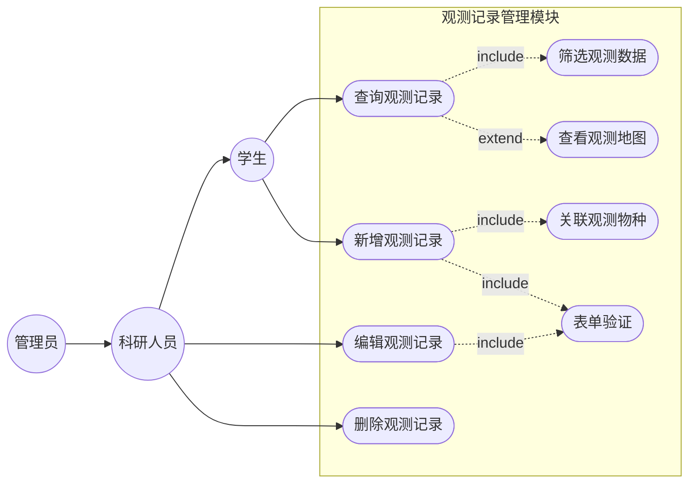
```mermaid
graph LR
    学生(("学生"))
    科研人员(("科研人员"))
    管理员(("管理员"))

    subgraph 观测记录管理模块
        UC_O1([查询观测记录])
        UC_O2([新增观测记录])
        UC_O3([编辑观测记录])
        UC_O4([删除观测记录])
        UC_O5([关联观测物种])
        UC_O6([查看观测地图])
        UC_O7([筛选观测数据])
        UC_VAL([表单验证])

        UC_O1 -. include .-> UC_O7
        UC_O2 -. include .-> UC_O5
        UC_O2 -. include .-> UC_VAL
        UC_O3 -. include .-> UC_VAL
        UC_O1 -. extend .-> UC_O6
    end

    学生 --> UC_O1
    学生 --> UC_O2
    科研人员 --> 学生
    科研人员 --> UC_O3
    科研人员 --> UC_O4
    管理员 --> 科研人员
```

---

## 三、系统架构图

### 3.1 前端分层架构图

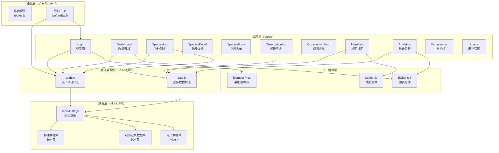
```mermaid
graph TB
    subgraph 表现层_Views["表现层（Views）"]
        V1["Login\n登录页"]
        V2["Dashboard\n数据看板"]
        V3["SpeciesList\n物种列表"]
        V4["SpeciesDetail\n物种详情"]
        V5["SpeciesForm\n物种表单"]
        V6["ObservationList\n观测列表"]
        V7["ObservationForm\n观测表单"]
        V8["MapView\n地图视图"]
        V9["Analytics\n统计分析"]
        V10["Ecosystems\n生态系统"]
        V11["Users\n用户管理"]
    end

    subgraph 路由层_Router["路由层（Vue Router 4）"]
        R1["路由配置\nroutes.js"]
        R2["导航守卫\nbeforeEach"]
    end

    subgraph 状态层_Store["状态管理层（Pinia Store）"]
        S1["auth.js\n用户认证状态"]
        S2["data.js\n业务数据状态"]
    end

    subgraph UI组件层["UI 组件层"]
        UI1["Element Plus\n基础组件库"]
        UI2["Leaflet.js\n地图组件"]
        UI3["ECharts 5\n图表组件"]
    end

    subgraph 数据层_Data["数据层（Mock API）"]
        A1["mockData.js\n模拟数据"]
        A2["物种数据集\n50+ 条"]
        A3["观测记录数据集\n30+ 条"]
        A4["用户数据集\n4种角色"]
    end

    V1 & V2 & V3 --> S1
    V3 & V6 & V8 & V9 --> S2
    S1 & S2 --> A1
    A1 --> A2 & A3 & A4
    R2 --> S1
    R2 --> V1
    V1 --> UI1
    V8 --> UI2
    V9 & V2 --> UI3
```

### 3.2 系统组件依赖图

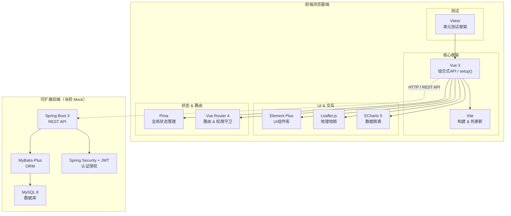
```mermaid
graph TB
    subgraph 前端浏览器端
        subgraph "核心框架"
            VUE["Vue 3\n组合式API / setup()"]
            VITE["Vite\n构建 & 热更新"]
        end

        subgraph "UI & 交互"
            EP["Element Plus\nUI组件库"]
            LEAFLET["Leaflet.js\n地理地图"]
            ECHARTS["ECharts 5\n数据图表"]
        end

        subgraph "状态 & 路由"
            PINIA["Pinia\n全局状态管理"]
            VR["Vue Router 4\n路由 & 权限守卫"]
        end

        subgraph "测试"
            VITEST["Vitest\n单元测试框架"]
        end
    end

    subgraph "可扩展后端（当前 Mock）"
        SB["Spring Boot 3\nREST API"]
        MP["MyBatis-Plus\nORM"]
        SS["Spring Security + JWT\n认证授权"]
        MYSQL["MySQL 8\n数据库"]
    end

    VUE --> EP & PINIA & VR & LEAFLET & ECHARTS
    VUE --> VITE
    VITEST --> VUE
    VUE -.->|HTTP / REST API| SB
    SB --> MP & SS
    MP --> MYSQL
```

---

## 四、类图

### 4.1 核心数据模型类图

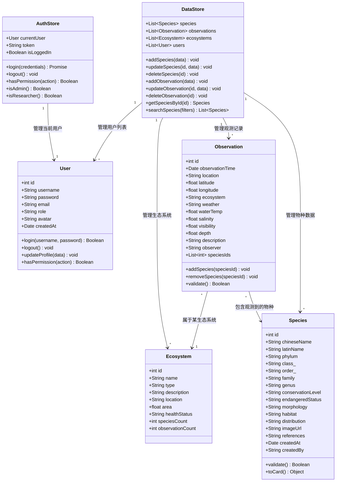
```mermaid
classDiagram
    class User {
        +int id
        +String username
        +String password
        +String email
        +String role
        +String avatar
        +Date createdAt
        +login(username, password) Boolean
        +logout() void
        +updateProfile(data) void
        +hasPermission(action) Boolean
    }

    class Species {
        +int id
        +String chineseName
        +String latinName
        +String phylum
        +String class_
        +String order_
        +String family
        +String genus
        +String conservationLevel
        +String endangeredStatus
        +String morphology
        +String habitat
        +String distribution
        +String imageUrl
        +String references
        +Date createdAt
        +String createdBy
        +validate() Boolean
        +toCard() Object
    }

    class Observation {
        +int id
        +Date observationTime
        +String location
        +float latitude
        +float longitude
        +String ecosystem
        +String weather
        +float waterTemp
        +float salinity
        +float visibility
        +float depth
        +String description
        +String observer
        +List~int~ speciesIds
        +addSpecies(speciesId) void
        +removeSpecies(speciesId) void
        +validate() Boolean
    }

    class Ecosystem {
        +int id
        +String name
        +String type
        +String description
        +String location
        +float area
        +String healthStatus
        +int speciesCount
        +int observationCount
    }

    class AuthStore {
        +User currentUser
        +String token
        +Boolean isLoggedIn
        +login(credentials) Promise
        +logout() void
        +hasPermission(action) Boolean
        +isAdmin() Boolean
        +isResearcher() Boolean
    }

    class DataStore {
        +List~Species~ species
        +List~Observation~ observations
        +List~Ecosystem~ ecosystems
        +List~User~ users
        +addSpecies(data) void
        +updateSpecies(id, data) void
        +deleteSpecies(id) void
        +addObservation(data) void
        +updateObservation(id, data) void
        +deleteObservation(id) void
        +getSpeciesById(id) Species
        +searchSpecies(filters) List~Species~
    }

    AuthStore "1" --> "1" User : 管理当前用户
    DataStore "1" --> "*" Species : 管理物种数据
    DataStore "1" --> "*" Observation : 管理观测记录
    DataStore "1" --> "*" Ecosystem : 管理生态系统
    DataStore "1" --> "*" User : 管理用户列表
    Observation "*" --> "*" Species : 包含观测到的物种
    Observation "*" --> "1" Ecosystem : 属于某生态系统
```

### 4.2 前端组件类图

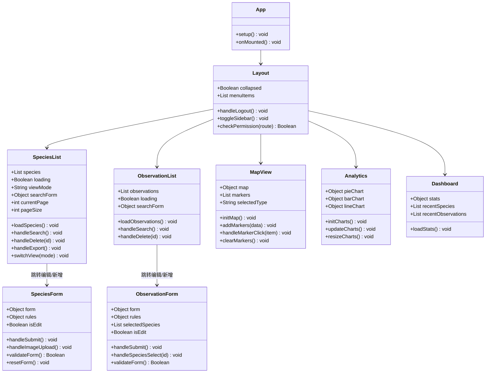
```mermaid
classDiagram
    class App {
        +setup() void
        +onMounted() void
    }

    class Layout {
        +Boolean collapsed
        +List menuItems
        +handleLogout() void
        +toggleSidebar() void
        +checkPermission(route) Boolean
    }

    class SpeciesList {
        +List species
        +Boolean loading
        +String viewMode
        +Object searchForm
        +int currentPage
        +int pageSize
        +loadSpecies() void
        +handleSearch() void
        +handleDelete(id) void
        +handleExport() void
        +switchView(mode) void
    }

    class SpeciesForm {
        +Object form
        +Object rules
        +Boolean isEdit
        +handleSubmit() void
        +handleImageUpload() void
        +validateForm() Boolean
        +resetForm() void
    }

    class ObservationList {
        +List observations
        +Boolean loading
        +Object searchForm
        +loadObservations() void
        +handleSearch() void
        +handleDelete(id) void
    }

    class ObservationForm {
        +Object form
        +Object rules
        +List selectedSpecies
        +Boolean isEdit
        +handleSubmit() void
        +handleSpeciesSelect(id) void
        +validateForm() Boolean
    }

    class MapView {
        +Object map
        +List markers
        +String selectedType
        +initMap() void
        +addMarkers(data) void
        +handleMarkerClick(item) void
        +clearMarkers() void
    }

    class Analytics {
        +Object pieChart
        +Object barChart
        +Object lineChart
        +initCharts() void
        +updateCharts() void
        +resizeCharts() void
    }

    class Dashboard {
        +Object stats
        +List recentSpecies
        +List recentObservations
        +loadStats() void
    }

    App --> Layout
    Layout --> SpeciesList
    Layout --> ObservationList
    Layout --> MapView
    Layout --> Analytics
    Layout --> Dashboard
    SpeciesList --> SpeciesForm : 跳转编辑/新增
    ObservationList --> ObservationForm : 跳转编辑/新增
```

---

## 五、ER 实体关系图

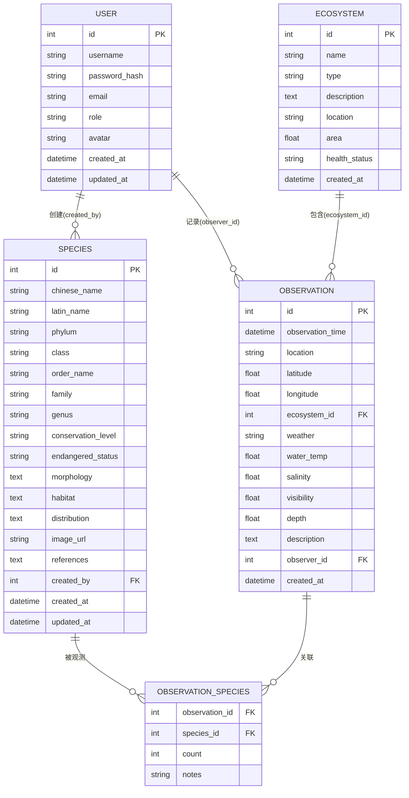
```mermaid
erDiagram
    USER {
        int id PK
        string username
        string password_hash
        string email
        string role
        string avatar
        datetime created_at
        datetime updated_at
    }

    SPECIES {
        int id PK
        string chinese_name
        string latin_name
        string phylum
        string class
        string order_name
        string family
        string genus
        string conservation_level
        string endangered_status
        text morphology
        text habitat
        text distribution
        string image_url
        text references
        int created_by FK
        datetime created_at
        datetime updated_at
    }

    OBSERVATION {
        int id PK
        datetime observation_time
        string location
        float latitude
        float longitude
        int ecosystem_id FK
        string weather
        float water_temp
        float salinity
        float visibility
        float depth
        text description
        int observer_id FK
        datetime created_at
    }

    ECOSYSTEM {
        int id PK
        string name
        string type
        text description
        string location
        float area
        string health_status
        datetime created_at
    }

    OBSERVATION_SPECIES {
        int observation_id FK
        int species_id FK
        int count
        string notes
    }

    USER ||--o{ SPECIES : "创建(created_by)"
    USER ||--o{ OBSERVATION : "记录(observer_id)"
    ECOSYSTEM ||--o{ OBSERVATION : "包含(ecosystem_id)"
    OBSERVATION ||--o{ OBSERVATION_SPECIES : "关联"
    SPECIES ||--o{ OBSERVATION_SPECIES : "被观测"
```

---

## 六、流程图

### 6.1 用户登录流程图

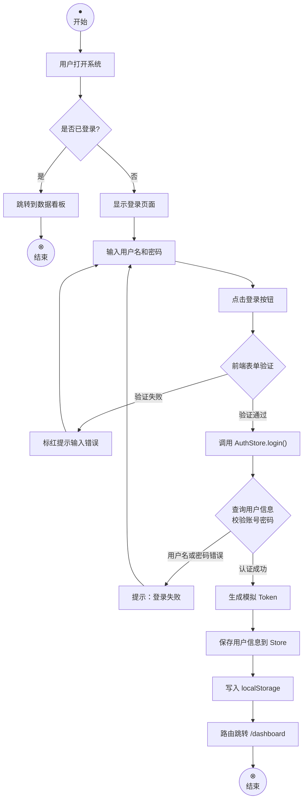
```mermaid
flowchart TD
    S(["●\n开始"]) --> A["用户打开系统"]
    A --> B{"是否已登录?"}
    B -->|是| C["跳转到数据看板"]
    C --> E2(["⊗\n结束"])
    B -->|否| D["显示登录页面"]
    D --> E["输入用户名和密码"]
    E --> F["点击登录按钮"]
    F --> G{"前端表单验证"}
    G -->|验证失败| H["标红提示输入错误"]
    H --> E
    G -->|验证通过| I["调用 AuthStore.login()"]
    I --> J{"查询用户信息\n校验账号密码"}
    J -->|"用户名或密码错误"| K["提示：登录失败"]
    K --> E
    J -->|认证成功| L["生成模拟 Token"]
    L --> M["保存用户信息到 Store"]
    M --> N["写入 localStorage"]
    N --> O["路由跳转 /dashboard"]
    O --> E3(["⊗\n结束"])
```

### 6.2 物种信息管理流程图

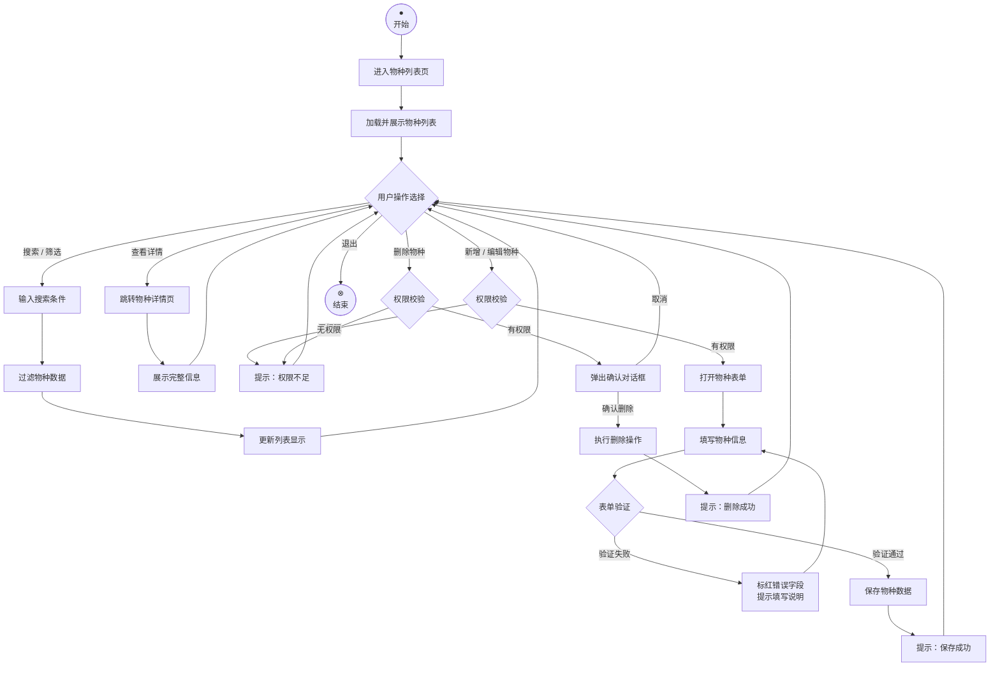
```mermaid
flowchart TD
    S(["●\n开始"]) --> A["进入物种列表页"]
    A --> B["加载并展示物种列表"]
    B --> C{"用户操作选择"}

    C -->|"搜索 / 筛选"| D["输入搜索条件"]
    D --> E["过滤物种数据"]
    E --> F["更新列表显示"]
    F --> C

    C -->|"查看详情"| G["跳转物种详情页"]
    G --> H["展示完整信息"]
    H --> C

    C -->|"新增 / 编辑物种"| I{"权限校验"}
    I -->|无权限| J["提示：权限不足"]
    J --> C
    I -->|有权限| K["打开物种表单"]
    K --> L["填写物种信息"]
    L --> M{"表单验证"}
    M -->|验证失败| N["标红错误字段\n提示填写说明"]
    N --> L
    M -->|验证通过| O["保存物种数据"]
    O --> P["提示：保存成功"]
    P --> C

    C -->|"删除物种"| Q{"权限校验"}
    Q -->|无权限| J
    Q -->|有权限| R["弹出确认对话框"]
    R -->|取消| C
    R -->|确认删除| T["执行删除操作"]
    T --> U["提示：删除成功"]
    U --> C

    C -->|"退出"| E2(["⊗\n结束"])
```

### 6.3 观测记录新增流程图

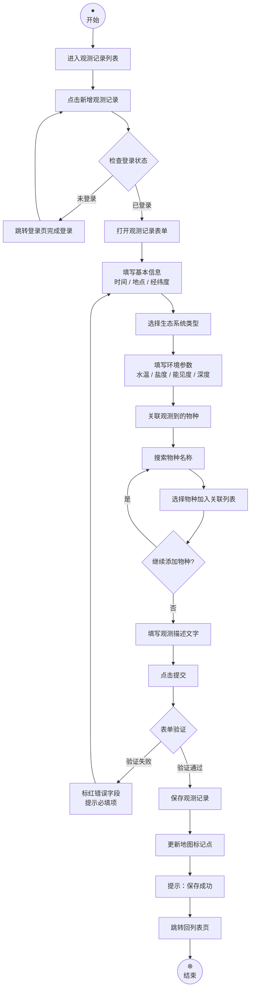
```mermaid
flowchart TD
    S(["●\n开始"]) --> A["进入观测记录列表"]
    A --> B["点击新增观测记录"]
    B --> C{"检查登录状态"}
    C -->|未登录| D["跳转登录页完成登录"]
    D --> B
    C -->|已登录| E["打开观测记录表单"]

    E --> F["填写基本信息\n时间 / 地点 / 经纬度"]
    F --> G["选择生态系统类型"]
    G --> H["填写环境参数\n水温 / 盐度 / 能见度 / 深度"]
    H --> I["关联观测到的物种"]
    I --> I1["搜索物种名称"]
    I1 --> I2["选择物种加入关联列表"]
    I2 --> I3{"继续添加物种?"}
    I3 -->|是| I1
    I3 -->|否| J["填写观测描述文字"]

    J --> K["点击提交"]
    K --> L{"表单验证"}
    L -->|验证失败| M["标红错误字段\n提示必填项"]
    M --> F
    L -->|验证通过| N["保存观测记录"]
    N --> O["更新地图标记点"]
    O --> P["提示：保存成功"]
    P --> Q["跳转回列表页"]
    Q --> R(["⊗\n结束"])
```

### 6.4 系统总体业务流程图

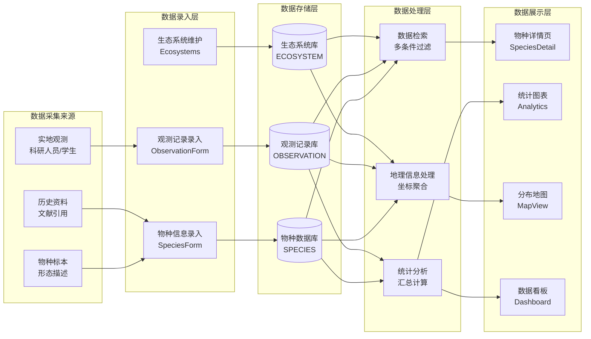
```mermaid
flowchart LR
    subgraph 数据采集来源
        A1["实地观测\n科研人员/学生"]
        A2["物种标本\n形态描述"]
        A3["历史资料\n文献引用"]
    end

    subgraph 数据录入层
        B1["物种信息录入\nSpeciesForm"]
        B2["观测记录录入\nObservationForm"]
        B3["生态系统维护\nEcosystems"]
    end

    subgraph 数据存储层
        C1[("物种数据库\nSPECIES")]
        C2[("观测记录库\nOBSERVATION")]
        C3[("生态系统库\nECOSYSTEM")]
    end

    subgraph 数据处理层
        D1["数据检索\n多条件过滤"]
        D2["统计分析\n汇总计算"]
        D3["地理信息处理\n坐标聚合"]
    end

    subgraph 数据展示层
        E1["物种详情页\nSpeciesDetail"]
        E2["统计图表\nAnalytics"]
        E3["分布地图\nMapView"]
        E4["数据看板\nDashboard"]
    end

    A1 --> B2
    A2 --> B1
    A3 --> B1
    B1 --> C1
    B2 --> C2
    B3 --> C3
    C1 --> D1 & D2 & D3
    C2 --> D1 & D2 & D3
    C3 --> D1 & D3
    D1 --> E1
    D2 --> E2 & E4
    D3 --> E3
```

---

## 七、时序图

### 7.1 用户登录时序图

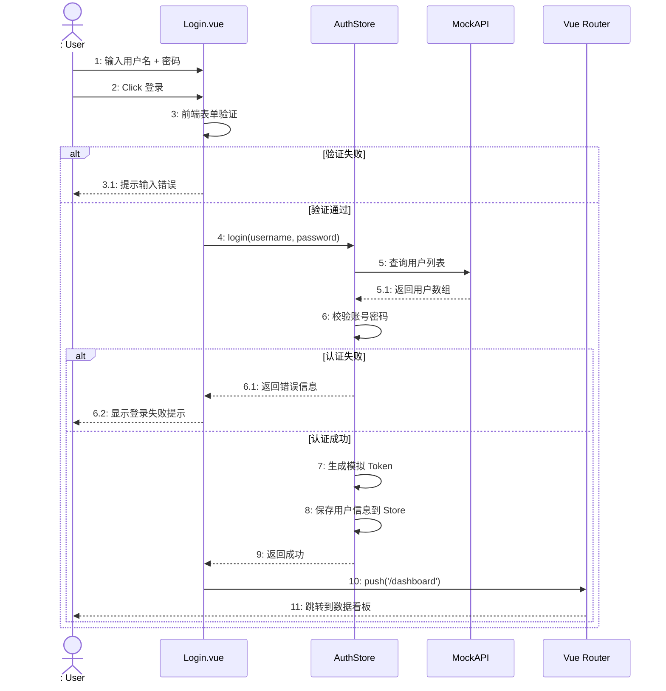
```mermaid
sequenceDiagram
    actor 用户 as : User
    participant 登录页面 as Login.vue
    participant 认证模块 as AuthStore
    participant 模拟数据 as MockAPI
    participant 路由模块 as Vue Router

    用户 ->> 登录页面: 1: 输入用户名 + 密码
    用户 ->> 登录页面: 2: Click 登录

    登录页面 ->> 登录页面: 3: 前端表单验证

    alt 验证失败
        登录页面 -->> 用户: 3.1: 提示输入错误
    else 验证通过
        登录页面 ->> 认证模块: 4: login(username, password)
        认证模块 ->> 模拟数据: 5: 查询用户列表
        模拟数据 -->> 认证模块: 5.1: 返回用户数组

        认证模块 ->> 认证模块: 6: 校验账号密码

        alt 认证失败
            认证模块 -->> 登录页面: 6.1: 返回错误信息
            登录页面 -->> 用户: 6.2: 显示登录失败提示
        else 认证成功
            认证模块 ->> 认证模块: 7: 生成模拟 Token
            认证模块 ->> 认证模块: 8: 保存用户信息到 Store
            认证模块 -->> 登录页面: 9: 返回成功
            登录页面 ->> 路由模块: 10: push('/dashboard')
            路由模块 -->> 用户: 11: 跳转到数据看板
        end
    end
```

### 7.2 新增物种时序图

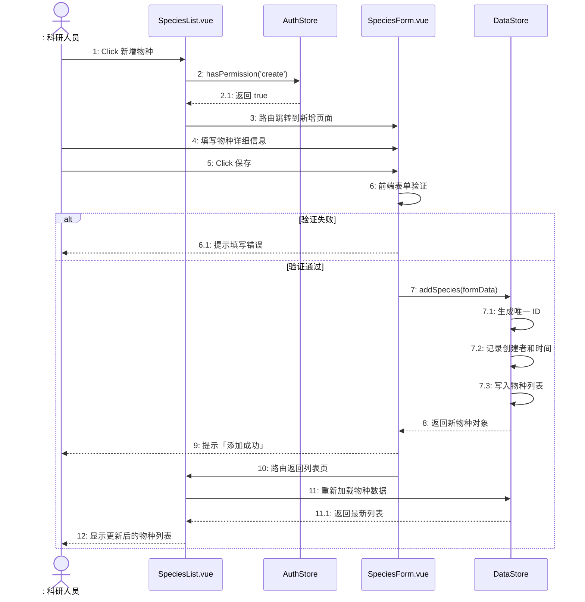
```mermaid
sequenceDiagram
    actor 科研人员 as : 科研人员
    participant 物种列表 as SpeciesList.vue
    participant 认证模块 as AuthStore
    participant 物种表单 as SpeciesForm.vue
    participant 数据模块 as DataStore

    科研人员 ->> 物种列表: 1: Click 新增物种

    物种列表 ->> 认证模块: 2: hasPermission('create')
    认证模块 -->> 物种列表: 2.1: 返回 true

    物种列表 ->> 物种表单: 3: 路由跳转到新增页面

    科研人员 ->> 物种表单: 4: 填写物种详细信息
    科研人员 ->> 物种表单: 5: Click 保存

    物种表单 ->> 物种表单: 6: 前端表单验证

    alt 验证失败
        物种表单 -->> 科研人员: 6.1: 提示填写错误
    else 验证通过
        物种表单 ->> 数据模块: 7: addSpecies(formData)
        数据模块 ->> 数据模块: 7.1: 生成唯一 ID
        数据模块 ->> 数据模块: 7.2: 记录创建者和时间
        数据模块 ->> 数据模块: 7.3: 写入物种列表
        数据模块 -->> 物种表单: 8: 返回新物种对象
        物种表单 -->> 科研人员: 9: 提示「添加成功」
        物种表单 ->> 物种列表: 10: 路由返回列表页
        物种列表 ->> 数据模块: 11: 重新加载物种数据
        数据模块 -->> 物种列表: 11.1: 返回最新列表
        物种列表 -->> 科研人员: 12: 显示更新后的物种列表
    end
```

### 7.3 查询物种时序图

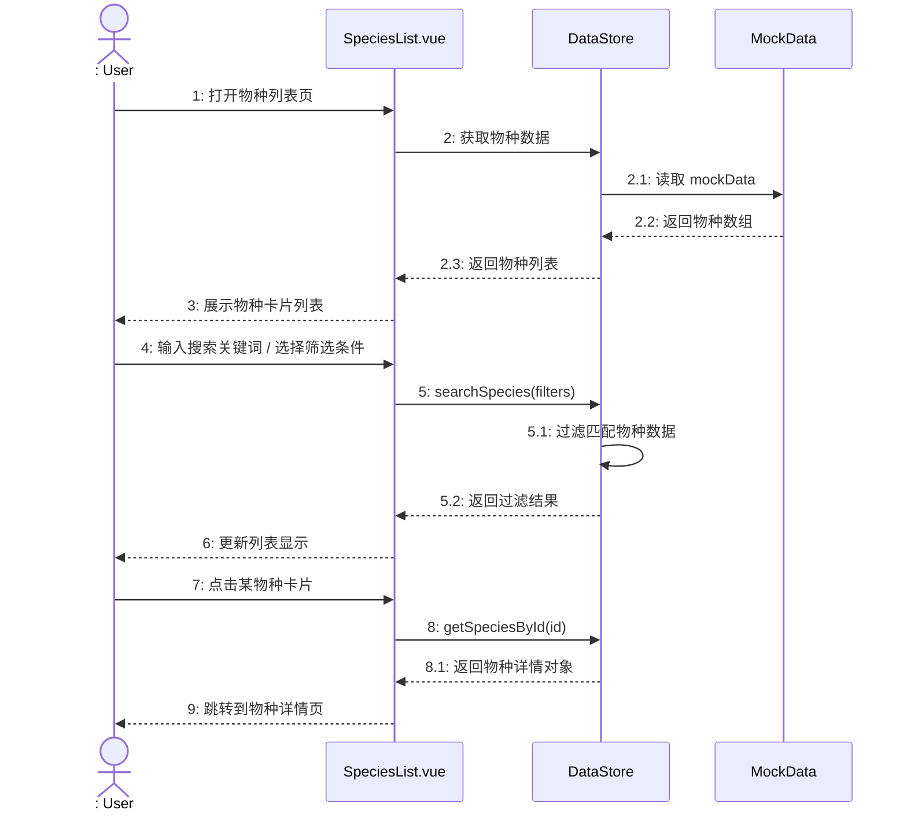
```mermaid
sequenceDiagram
    actor 用户 as : User
    participant 物种列表 as SpeciesList.vue
    participant 数据模块 as DataStore
    participant 模拟数据 as MockData

    用户 ->> 物种列表: 1: 打开物种列表页
    物种列表 ->> 数据模块: 2: 获取物种数据
    数据模块 ->> 模拟数据: 2.1: 读取 mockData
    模拟数据 -->> 数据模块: 2.2: 返回物种数组
    数据模块 -->> 物种列表: 2.3: 返回物种列表
    物种列表 -->> 用户: 3: 展示物种卡片列表

    用户 ->> 物种列表: 4: 输入搜索关键词 / 选择筛选条件
    物种列表 ->> 数据模块: 5: searchSpecies(filters)
    数据模块 ->> 数据模块: 5.1: 过滤匹配物种数据
    数据模块 -->> 物种列表: 5.2: 返回过滤结果
    物种列表 -->> 用户: 6: 更新列表显示

    用户 ->> 物种列表: 7: 点击某物种卡片
    物种列表 ->> 数据模块: 8: getSpeciesById(id)
    数据模块 -->> 物种列表: 8.1: 返回物种详情对象
    物种列表 -->> 用户: 9: 跳转到物种详情页
```

### 7.4 删除物种时序图

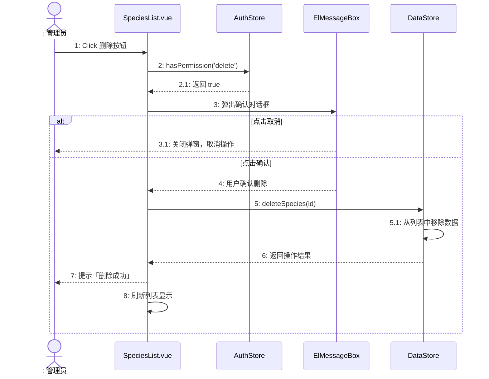
```mermaid
sequenceDiagram
    actor 管理员 as : 管理员
    participant 物种列表 as SpeciesList.vue
    participant 认证模块 as AuthStore
    participant 确认弹窗 as ElMessageBox
    participant 数据模块 as DataStore

    管理员 ->> 物种列表: 1: Click 删除按钮
    物种列表 ->> 认证模块: 2: hasPermission('delete')
    认证模块 -->> 物种列表: 2.1: 返回 true

    物种列表 ->> 确认弹窗: 3: 弹出确认对话框

    alt 点击取消
        确认弹窗 -->> 管理员: 3.1: 关闭弹窗，取消操作
    else 点击确认
        确认弹窗 -->> 物种列表: 4: 用户确认删除
        物种列表 ->> 数据模块: 5: deleteSpecies(id)
        数据模块 ->> 数据模块: 5.1: 从列表中移除数据
        数据模块 -->> 物种列表: 6: 返回操作结果
        物种列表 -->> 管理员: 7: 提示「删除成功」
        物种列表 ->> 物种列表: 8: 刷新列表显示
    end
```

---

## 八、状态图

### 8.1 用户登录状态图

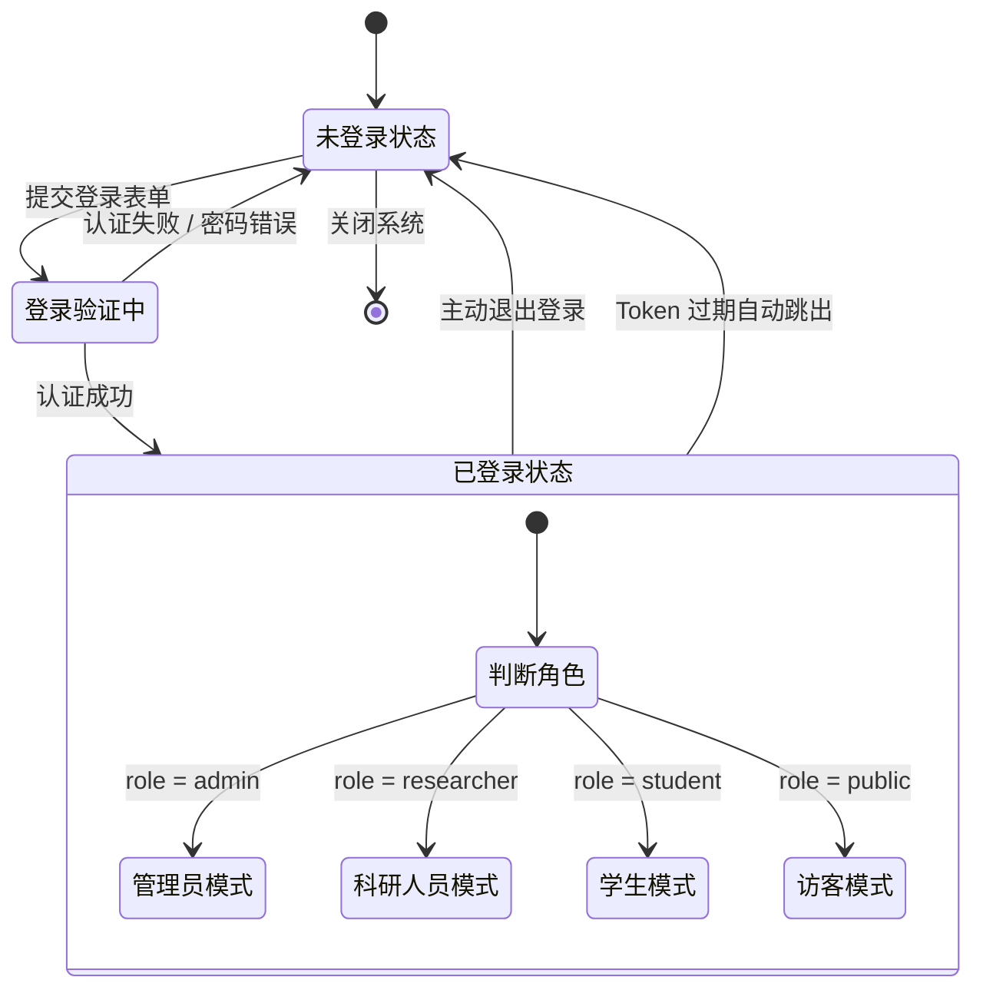
```mermaid
stateDiagram-v2
    [*] --> 未登录状态

    未登录状态 --> 登录验证中 : 提交登录表单
    登录验证中 --> 未登录状态 : 认证失败 / 密码错误
    登录验证中 --> 已登录状态 : 认证成功

    state 已登录状态 {
        [*] --> 判断角色
        判断角色 --> 管理员模式 : role = admin
        判断角色 --> 科研人员模式 : role = researcher
        判断角色 --> 学生模式 : role = student
        判断角色 --> 访客模式 : role = public
    }

    已登录状态 --> 未登录状态 : 主动退出登录
    已登录状态 --> 未登录状态 : Token 过期自动跳出

    未登录状态 --> [*] : 关闭系统
```

### 8.2 物种信息状态图

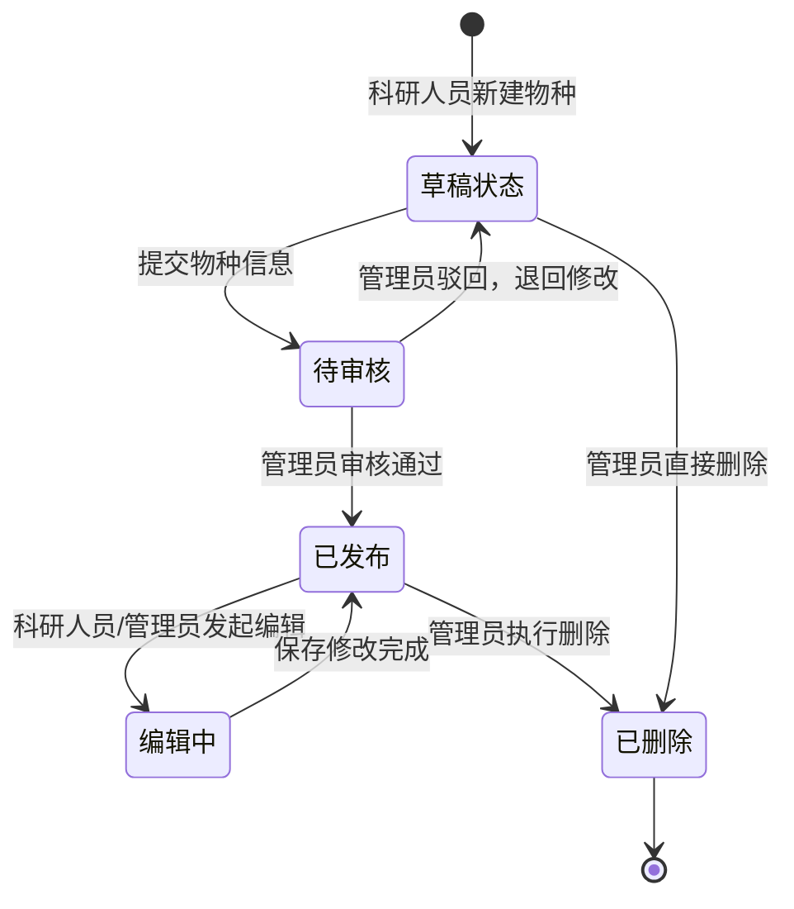
```mermaid
stateDiagram-v2
    [*] --> 草稿状态 : 科研人员新建物种

    草稿状态 --> 待审核 : 提交物种信息
    待审核 --> 已发布 : 管理员审核通过
    待审核 --> 草稿状态 : 管理员驳回，退回修改

    已发布 --> 编辑中 : 科研人员/管理员发起编辑
    编辑中 --> 已发布 : 保存修改完成

    已发布 --> 已删除 : 管理员执行删除
    草稿状态 --> 已删除 : 管理员直接删除

    已删除 --> [*]
```

### 8.3 观测记录状态图

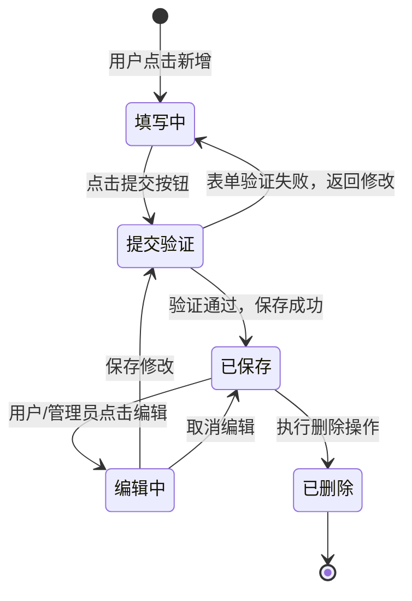
```mermaid
stateDiagram-v2
    [*] --> 填写中 : 用户点击新增

    填写中 --> 提交验证 : 点击提交按钮
    提交验证 --> 填写中 : 表单验证失败，返回修改
    提交验证 --> 已保存 : 验证通过，保存成功

    已保存 --> 编辑中 : 用户/管理员点击编辑
    编辑中 --> 提交验证 : 保存修改
    编辑中 --> 已保存 : 取消编辑

    已保存 --> 已删除 : 执行删除操作

    已删除 --> [*]
```

---

## 九、系统功能思维导图

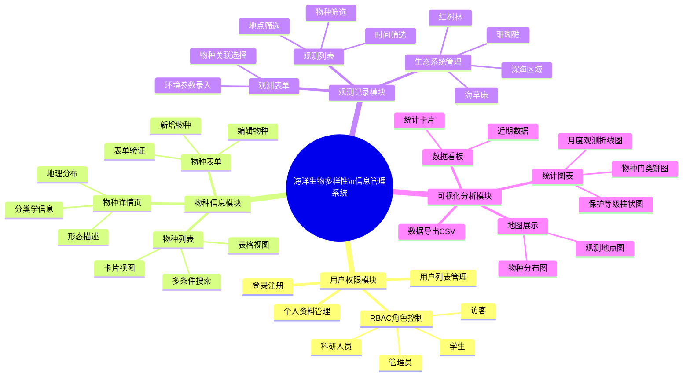
```mermaid
mindmap
  root((海洋生物多样性\n信息管理系统))
    用户权限模块
      登录注册
      RBAC角色控制
        管理员
        科研人员
        学生
        访客
      个人资料管理
      用户列表管理
    物种信息模块
      物种列表
        卡片视图
        表格视图
        多条件搜索
      物种详情页
        分类学信息
        形态描述
        地理分布
      物种表单
        新增物种
        编辑物种
        表单验证
    观测记录模块
      观测列表
        时间筛选
        地点筛选
        物种筛选
      观测表单
        环境参数录入
        物种关联选择
      生态系统管理
        珊瑚礁
        红树林
        海草床
        深海区域
    可视化分析模块
      数据看板
        统计卡片
        近期数据
      地图展示
        物种分布图
        观测地点图
      统计图表
        物种门类饼图
        保护等级柱状图
        月度观测折线图
      数据导出CSV
```

---

*文档版本：v2.0 | 生成时间：2026-03-26 | 项目：海洋生物多样性信息管理系统*
